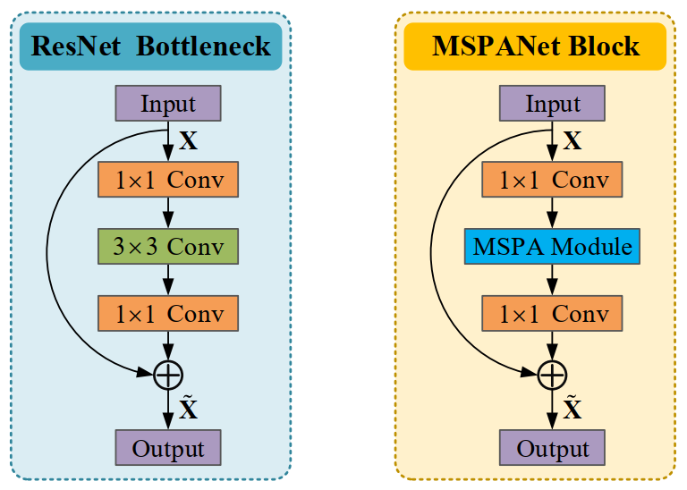

# Multi-Scale Spatial Pyramid Attention Mechanism

***The official PyTorch implementation of "Multi-scale spatial pyramid attention mechanism for image recognition: An effective approach".***

## Approach

  

  Figure 1: The overall architecture of the proposed MSPA module.

**Description.** It contains three core components, i.e., the HPC module, the SPR module, and the Softmax operation. The HPC module is designed for extracting multi-scale spatial information. The SPR module is responsible for learning channel attention weights to build cross-dimension interaction. The Softmax operation is used to recalibrate channel-wise attention weights to establish long-range channel dependencies.

**MSPA.** Detail of implementations, including modules and the networks, can be found in ``Cifar`` and ``ImageNet`` in this repository. 

## Our environments and toolkits

- OS: Ubuntu 18.04.1
- CUDA: 11.6
- Python: 3.9.12
- Toolkit: PyTorch 1.10
- GPU: RTX A6000 (4x)
- [thop](https://github.com/Lyken17/pytorch-OpCounter)
- [ptflops](https://github.com/sovrasov/flops-counter.pytorch)
- For generating GradCAM++ results, please follow the code on this [repository](https://github.com/jacobgil/pytorch-grad-cam)

## How to incorporate the proposed MSPA module into ResNets

  

  Figure 2: Illustration and comparison between the original bottleneck residual block (left) and the basic building block of the proposed MSPANet (right).

## Overview of Results

### Comparison of the performance of MSPANet-50 with the change of s and ω on CIFAR-100 classification

  

  Figure 3: Illustration and comparison of the performance of MSPANet-50 with the change of s and ω on CIFAR-100 classification. 

### Comparison of training and validation curves on ImageNet-1K

  

  Figure 4: Comparisons of training and validation curves on ImageNet-1K for ResNet, MSPANet-S, and MSPANet-B architectures of 50 and 101 layers, respectively.

### Classification performance on CIFAR-100

  

  Figure 5: Comparisons of various attention methods on the CIFAR-100 test set in terms of network parameters (Parameters), floating-point operations (FLOPs), and Top-1 accuracy (Top-1 Acc), using ResNet-50, ResNeXt-29, and PreActResNet-164 as baselines, respectively.

### Classification performance on ImageNet-1K

  

  Figure 6: Comparisons of efficiency (i.e., Parameters and FLOPs) and effectiveness (i.e., Top-1/Top-5Acc) of various attention methods and different multi-scale representation architectures on the ImageNet-1K validation set when taking ResNet with 50 and 101 layers as backbones, respectively.

## Citation
If you find MCA useful in your research, please consider citing:

## Contact Information

If you have any suggestion or question, you can leave a message here or contact us directly: yang_y9802@163.com. Thanks for your attention!